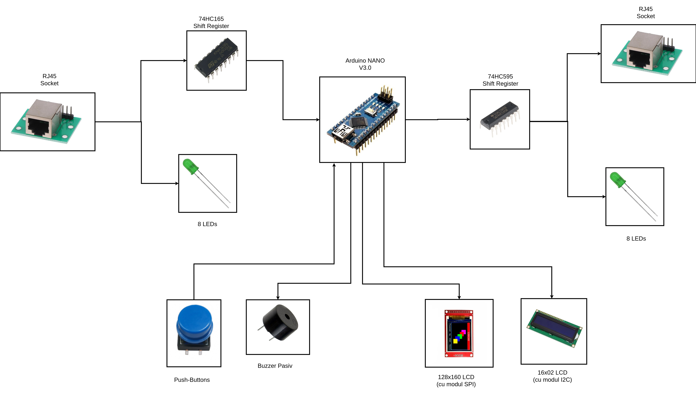
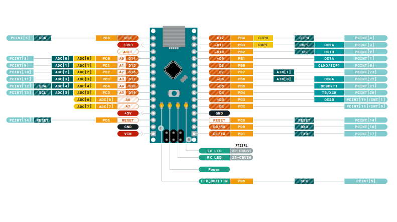
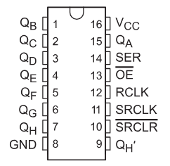
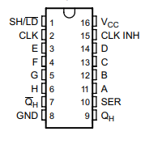
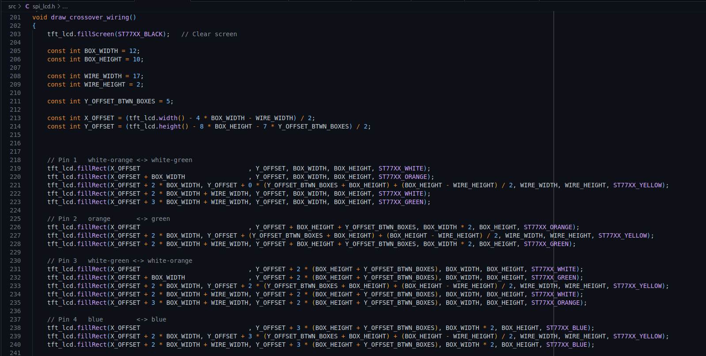
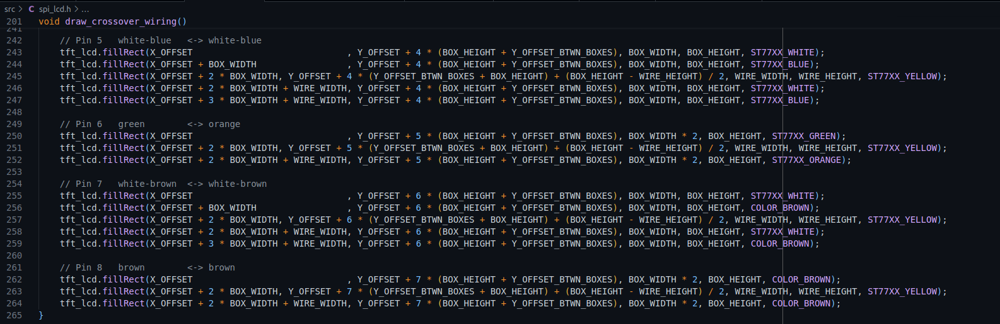
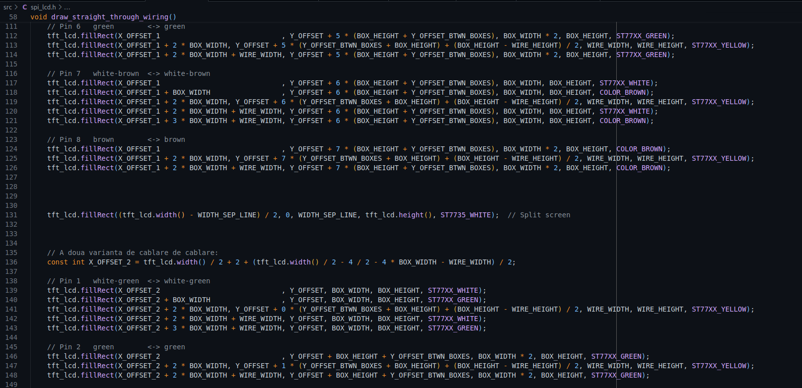

# RJ45 Tester

## Introducere

### De la idee la prototip

Vă amintiți primul laborator de **RL**?

Acolo am învățat cum să realizăm un **cablu UTP** pentru rețele Ethernet,
Procesul poarta numele de **sertizare**.
După realizarea cablului, acesta trebuie verificat ca functioneaza corect - adică dacă are continuitate.

Testarea se face folosind un dispozitiv dedicat.

De aici a pornit ideea proiectului meu: realizarea propriului meu [tester RJ45](https://www.optimusdigital.ro/ro/aparate-de-masura/4962-tester-rj45-rj11.html?search_query=rj45&results=22),
caruia i-am adus o serie de îmbunătățiri.

### Ce face dispozitivul?

Dispozitivul proiectat permite testarea cablurilor de rețea de tip **RJ45**,
oferind feedback vizual și auditiv privind corectitudinea conexiunilor dintre pini.

Prin simpla apăsare a unui buton, utilizatorul poate selecta tipul de cablu testat:
1. **Straight-through** - pentru conectarea dispozitivelor aflate pe *layere diferite* (ex: PC – switch)
2. **Crossover** - pentru conectarea dispozitivelor de *același layer* (ex: PC - PC)

După selectare, pe ecranul principal (128x160 SPI) este afișată o imagine cu ordinea corectă a firelor pentru tipul respectiv de cablu.


Rolul hardware-ului in testare:
- Se folosesc 2 socketi: unul dedicat pentru **sender**, iar celalalt pentru **receiver**
-  Fiecare soclu RJ-45 are 8 pini
- Fiecarui pin RJ-45 ii este asociat un LED de culoare verde care se va aprinde
    atunci cand semnalul transmis/primit pe pinul respectiv este de 1 logic.
- In momentul in care socket-ul de **receiver** receptioneaza **1 logic**, buzzer-ul va emite un beep scurt


Testarea efectiva presupune 2 verificari:
1. Se vor trimite semnale, secvential, iterand pinii **sender**-ului unul cate unul, cu mici pauze intre transmisii,
2. urmand un test final in care se vor activa simultan toti pinii **sender**-ului


Testar-ul poate fi oprită forțat, in orice moment,  prin apăsarea unui buton.

In timp ce display-ul pe SPI (de rezolutie mai mare)
afiseaza ordinea firelor in mufa RJ-45,
LCD-ul cu modul I2C va scrie pe ecran tipul de cablu **straight-through**/**crossover**
si indexul pinului de pe **sender** de pe care se trimit semnale
(e.g. *"Testing pin 1...8"*), sau mesajul *"Testing all pins"*.


### De ce este util?

Consider ca folosirea ecranelor face diferenta dintre un tester RJ-45 obisnuit
si device-ul.

Practic, este un instrument **"2 în 1"**: tester + ghid de conectare.

Sper ca dispozivitul pe care il proiectez
(imi propun sa ii fac si un **PCB compact**)
sa ajunga in mainile laborantilor de RL/CCNA1.
Acolo isi va atinge adevaratul potential.


## Descriere Generala


Schema bloc:




## Hardware Design


### Lista Componente

| Componenta | Pret |
| :--- | :--- |
| [Arduino Nano V3.0](https://www.emag.ro/placa-de-dezvoltare-nano-v3-0-atmega328p-ch340-cu-cablu-usb-1414dr/pd/DTDC88YBM/?ref=history-shopping_415312802_171246_1) | ~40 lei |
| 2x [RJ45 Adapter Board + Breakout Board + Pin Header](https://www.aliexpress.com/item/1005006421216570.html?spm=a2g0o.productlist.main.1.7a83OBnaOBnaHZ&algo_pvid=00f91974-4220-41f5-8c1c-f9375b3e09d7&pdp_ext_f=%7B%22order%22%3A%22150%22%2C%22eval%22%3A%221%22%7D&utparam-url=scene%3Asearch%7Cquery_from%3A) (de pe AliExpress 😊) | ~8 lei fiecare |
| 1x [74HC595 8-bit Shift Register](https://ardushop.ro/ro/circuite-integrate/1657-ic-shift-register-sn74hc595n-74hc595-6427854024978.html) (1 pin intrare, 8 pini de iesire) | 4 lei |
| 1x [74HC165 8-bit Shift Register](https://ardushop.ro/ro/electronica/683-74hc165-8-bit-shift-register-6427854008602.html) (1 pin iesire, 8 pini de intrare) | 8 lei |
| [LCD 16x02 cu interfata I2C](https://www.optimusdigital.ro/ro/optoelectronice-lcd-uri/2894-lcd-cu-interfata-i2c-si-backlight-albastru.html?search_query=0104110000003584&results=1) | ~16 lei |
| [Modul LCD SPI 160x128](https://ardushop.ro/ro/electronica/2124-modul-lcd-spi-128x160-6427854032546.html) | ~44 lei |
| 16x [LED Verde 3mm cu Lentile Difuze](https://www.optimusdigital.ro/ro/optoelectronice-led-uri/697-led-verde-de-3-mm-cu-lentile-difuze.html?search_query=0104210000006209&results=1) | 0,40 lei fiecare |
| 16x Rezistente 220 Ω (pt LED-uri) | |
| [Buzzer Pasiv](https://www.optimusdigital.ro/ro/audio-buzzere/12247-buzzer-pasiv-de-33v-sau-3v.html?search_query=buzzer+pasiv&results=14) | 1 leu |
| 3x [Buton cu Capac Rotund](https://www.optimusdigital.ro/ro/butoane-i-comutatoare/1115-buton-cu-capac-rotund-alb.html?search_query=buton+cu+capac&results=29) | 2 lei fiecare |
| 3x Rezistente (de PULL-UP) de 10 kΩ (pt butoane) |
| 3x [Condensatoare ceramice de 47nF](https://www.optimusdigital.ro/ro/componente-electronice-condensatoare/7817-condensator-ceramic-47-nf-50-v.html?search_query=47nF&results=2) (pt butoane) | 0,50 lei fiecare |
| 3x [Breadboard 830 puncte](https://ardushop.ro/ro/electronica/2297-breadboard-830-puncte-mb-102-6427854012265.html) | 20 lei fiecare |
| [Set fire PVC (Fir unifilar) - 22 AWG](https://www.optimusdigital.ro/ro/kituri/12264-set-de-fire-cu-izolaie-pvc-22awg-6-culori-10m-fiecare-0721248989765.html?search_query=0104110000073266&results=1) | 45 lei |
| Jumpere tata-tata | |
| Jumpere mama-tata | |


Componente auxiliare, specifice tester-ului RJ-45:

| Componenta | Pret |
| :--- | :--- |
| 2 metri cablue UTP | 0 lei (de la CCNA 😊)  |
| [Cleste Universal Sertizat Conectori RJ-45](https://www.emag.ro/cleste-universal-sertizat-conectori-rj-45-rj-12-rj-11-lhpnar0051/pd/DB3JFDBBM/?ref=history-shopping_422165558_63416_1) | 15 lei |
| [SET 50 Buc - Mufa RJ45 UTP/FTP cu 8 pini 8P8C](https://www.emag.ro/set-50-buc-mufa-rj45-utp-ftp-cu-8-pini-8p8c-s50-rj45/pd/DZ94TCBBM/?ref=history-shopping_422165558_56854_1) | 15 lei |
| [Tester Continuitate RJ45](https://www.optimusdigital.ro/ro/aparate-de-masura/4962-tester-rj45-rj11.html?search_query=rj45&results=22) | 15 lei |
| Baterie 9V | |


### Schema Electrica


### Pin configurations

#### Arduino



| Pin Arduino | Corespondent |
| :--- | :--- |
| D2 | Butonul albastru (BTN1) |
| D3 | Butonul rosu (BTN2) |
| D4 | Butonul alb (BTN3) |
| D5 | Buzzer pasiv |
| D6 | Data OUT 74HC595 (SER) |
| D7 | Latch 74HC595 (RCLK) |
| D8 | Clock 74HC595 (SRCLK) |
| D9 | RS-Display |
| D10 | CS-Diplsay |
| D11 | (SPI) MOSI |
| D12 | (SPI) MISO |
| D13 | (SPI) SCK|
| D14 (etichetat A0) | Data IN 74HC165 |
| D15 (etichetat A1) | PL 74HC165 |
| D16 (etichetat A2) | CLK 74HC165 |
| A4 | (I2C) SDA |
| A5 | (I2C) SDA |


#### 160x128 Display (pe SPI)


| Denumire pin | Descriere |
| :--- | :--- |
| Vcc | Vcc
| GND | Ground |
| NC | Not Connected (nu se conecteaza la nimic) |
| CLK | Clock |
| SDA | este pinul de **MOSI** (foarte confuz ca au scris SDA in loc de **MOSI**) |
| RS | Register Select |
| RST | Reset |
| CS | Chip Select |

> Pinul RS (Register Select) este cunoscut si sub numele de DC (Data Command).
> 
> Acest pin indica daca datele trimise pe SPI sunt:
> - comenzi (e.g.: seteaza pozitia cursorului)
> - date (e.g. afiseaza pixeli pe ecran)
> 
> Pinul are urmaoare functionalitate:
> - Daca RS/DC = 0 -> comanda
> - Daca RS/DC = 1 -> date

| Pin Display SPI | Corespondent |
| :--- | :--- |
| Vcc | 5V |
| GND | GND |
| NC | nu se conecteaza la nimic |
| CLK | Arduino D13 (SPI SCK) |
| SDA | Arduino D11 (SPI MOSI) |
| RS | Arduino D9 |
| RST | Arduino RESET |
| CS | Arduino D10 |


#### 74HC595 shift register

> Shift register-ul **74HC595** are o singura intrare si **8 iesiri paralele**.




| Index pin 74HC595 | Denumire pin 74HC595 | Corespondent |
| :--- | :--- | :--- |
| 15 | Q<sub>A</sub> | LED 1 (cel mai de sus) & pin 1 socket RJ-45 sender |
| 1  | Q<sub>B</sub> | LED 2 (al doilea cel mai de sus) & pin 2 socket RJ-45 sender |
| 2  | Q<sub>C</sub> | LED 3 & pin 3 socket RJ-45 sender |
| 3  | Q<sub>D</sub> | LED 4 & pin 4 socket RJ-45 sender |
| 4  | Q<sub>E</sub> | LED 5 & pin 5 socket RJ-45 sender |
| 5  | Q<sub>F</sub> | LED 6 & pin 6 socket RJ-45 sender |
| 6  | Q<sub>G</sub> | LED 7 & pin 7 socket RJ-45 sender |
| 7  | Q<sub>H</sub> | LED 8 & pin 8 socket RJ-45 sender |
| 8  | GND | GND |
| 9  | !Q<sub>H</sub> | nmk |
| 10 | !SRCLR | 5V |
| 11 | SRCLK | Arduino D8 |
| 12 | RCLK | Arduino D7 |
| 13 | !OE | GND
| 14 | SER | Arduino D6 |
| 16 | Vcc | 5V |

> LED-ul la care fac referire aici sunt cele din partea stanga, asociata **sender**-ului.


#### 74HC165 shift register

> Shift register-ul **74HC165** are o singura iesire si **8 intrari paralele**.



| Index pin 74HC165 | Denumire pin 74HC165 | Corespondent |
| :--- | :--- | :--- |
| 7 | !Q<sub>H</sub> | nmk |
| 9 | Q<sub>H</sub> | Arduino D14 (etichetat A0) |
| 1 | SH/!LD | Arduino D15 (etichetat A1) |
| 2 | CLK | Arduino D16 (etichetat A2) |
| 8 | GND | GND |
| 16 | Vcc | 5V |
| 10 | SER | GND |
| 15 | CLK INH | GND |
| 11 | A (out1) | LED 1 (cel mai de sus) & pin 1 socket RJ-45 receiver |
| 12 | B (out1) | LED 2 (al doilea cel mai de sus) & pin 2 socket RJ-45 receiver |
| 13 | C (out1) | LED 3 & pin 2 socket RJ-45 receiver |
| 14 | D (out1) | LED 4 & pin 3 socket RJ-45 receiver |
| 3 | E (out1) | LED 5 & pin 4 socket RJ-45 receiver |
| 4 | F (out1) | LED 6 & pin 5 socket RJ-45 receiver |
| 5 | G (out1) | LED 7 & pin 6 socket RJ-45 receiver |
| 6 | H (out1) | LED 8 & pin 7 socket RJ-45 receiver |


### Debounce butoane: Filtru trece-jos

Pentru a trata **debounce-ul butoanelor** exclusiv din hardware,
m-am gandit sa introduc in circuit un **filtru trece-jos**,
punand cate un condensator ceramic in paralel cu fiecare buton.

Constanta de timp τ:

```
τ = R*C =10kΩ*47nF = 10^4 + 47*10^(-9) = 47*10^(-5) = 470us

5*τ=5*470μs≈2.35ms
```


Astfel, schimbarile mai rapide de **2.35 ms** ale butoanelor
vor fi ignorate (la nivel hardware) de aceste filtre.


> Chiar si asa, eu tot am lasat in cod un mic **delay**
> (unul mult mai mare decat ce poate circuitul construit de mine sa filtreze).


### Progresul fizic, pe etape


## Software Design


Biblioteci folosite:
- **Arduino.h**: biblioteca default pentru placa de dezvoltare
- **LiquidCrystal_I2C.h**: imi permite scrierea caracterelor pe ecranul secundar (cel pe I2C, de rezolutie 16x02)
- **Adafruit_GFX.h**, **Adafruit_ST7735.h**: pentru interactiunea cu display-ul principal (cel pe SPI, de rezolutie 160x128)

Repo GitHub: <https://github.com/TrifanBogdan24/RJ45-tester> - codul sursa se gaseste in folderul **src/**.


Am asociat fiecarui buton cate o intrerupere:
- Butonul **albastru** - intreruperea **INT0** - schimba tipul de cablare (crossover/straigh-through)
- Butonul **rosu** - intreruperea **INT1** - opreste fortat rularea testului
- Butonul **alb** - intreruperea **PCINT20** (din **PCINT2_vect**)  - porneste algoritmul de testare:


Descrierile functiilor:
- `ISR(INT0_vect)`:
  - rutina de tratare a intreruperii, generata la apasarea butonului **albastru** (schimba tipul de cablare)
  - Marcheaza flag-ul `volatile bool pressedBTN1`
- `ISR(INT1_vect)`: 
  - rutina de tratare a intreruperii, generata la apasarea butonului **rosu** (oprirea fortata a algoritmului de testare)
  - Marcheaza flag-ul `volatile bool pressedBTN2`
- `ISR(PCINT2_vect)`:
  - rutina de tratare a intreruperii, generata la apasarea butonului **alb** (pornirea algoritmului de testare)
  - Marcheaza flag-ul `volatile bool pressedBTN3`
- `void beep_okay()`: controleaza buzzer-ul sa emita bazait scurt, in semn ca totul este in regula
- `void beep_not_okay()`: controleaza buzzer-ul sa emita un semnal sonor de eroare
- `void cable_type_first_line_lcd()`: scrie tipul de cablare pe prima linia a LCD-ului de rezolutie 16x02
- `void cable_mode_full_lcd()`:
  scrie pe textul "Mode:" pe prima linia a display-ului secundar (cel pe I2C, de 16x02),
  iar pe a doua, tipul de cablare
- `void force_stop_handler()`:
  - Functia este apelata in urma apasarii butonului **rosu**.
  Opreste fortat algoritmul de testare,
  dar nu inainte de a afisa pe ecranul LCD pe I2C un mesaj sugestiv in acest sens
  `lcd.print("Force stop!");`
- `void write_to_sender_socket()`:
  - Variabila `bool pinsSenderSocket[8]` retine starea pinilor din mufa RJ-45 de transmisie
  - Functia scrie valorile din `bool pinsSenderSocket[8]` in shift register-ul **74HC595**,
  - Scrierea (chiar si pe un singur pin) al socket-ului sender presupune scrierea tuturor celor 8 valori
    catre **shift register**, in ordine inversa
    (intrucat acesta foloseste **MSB**: prima valoare primita va fi asociata ultimului pin)
- `void init_sender_pins()`:
  Este apelata la pornirea micro-controler-ului
  pentru a trata starea initiala indefinita
  (uneori LED-uri se pot aprinde aleator, fara ca eu nici macar sa fi scris ceva in shift register)
  a shift register-ului **74HC595**, asociat socket-ului sender.
- `void fetch_receiver_socket()`:
  Citeste valorile de pe shift register-ul **74HC165** (asociat socket-ului receiver)
  si le scrie in variabila `bool pinsReceiverSocket[8];`
- `bool is_correct_wiring(int pin_index)`:
  - Apeleaza `is_correct_wiring` pentru a citi semnalele de pinii socket-ului receiver
  - Si verifica daca valorile corespund unei cablari corecte,
  in raport cu indexul pinului activat pe mufa RJ-45 de transmisie
- `int test_individual_rj45_pins()`:
  - Algoritmul propriu zis de testare
  - Parcurge iterativ, de la 1 la 8, toti pinii socket-ului sender si
    1. Scrie pe ecranul secundar (16x02): modul de cablare, indexul pinului RJ-45 de transmisie
      si indexul corect pe care se asteapta sa primeasca semnal de pe pinul RJ-45 de receptie
    2. Scrie "1 logic" in iesirea (shift register-ului) **74HC595** corespunzatoare pinului ales:
      lucru care va produce aprinderea unui LED
    3. Ruleaza un mic `delay()` pentru a ma asigura ca semnalul are timp sa ajunga de la un capat la altul
    4. Apeleaza functia `is_correct_wiring` pentru a afla daca semnalul ajuns unde trebuie:
      - Daca da, va scrie in *"OK"* in coltul dreapta-jos al display-ului secundar si va emita un bapait scurt
      - Altfe, va scrie *"NOK"* pe LCD si va produce un sunet de avertistment
  - Functia verifica constant daca butonul **rosu** a fost apasat (flag-ul `pressedBTN2` a fost setat),
    caz in care opreste fortat algorimul de testare, apeland `force_stop_handler()` in cod
- `void init_tft_lcd()`: initializeaza display-ul principal (cel pe SPI, de rezolutie 160x128)
- `void draw_straight_through_wiring()`/`void draw_crossover_wiring()`/`void draw_rollover_wiring()`:
  - Aceste functii afiseaza grafic ordinea firelor pentru cele doua capete ale unui cablu de retea
  - In functie de tipul de cablare selectat (straight-through/crossover/rollover)
  - Ordinea firelor este redata conform standardelor prezentate in **cursul de RL**
- `setup()`
  - configureza pinii de Input/Outpt
  - activeaza intreruperile
  - initiaza display-urile
  - scrie in registrii
- `loop()`
  - Verifica si trateaza flag-urile `pressedBTN1` si `pressedBTN3`
  - > NOTA: flag-ul `pressedBTN2` este tratat in interiorul algoritmului de testare (in functia `test_individual_rj45_pins()`)
  - Reseteaza flag-urile
  - Ruleaza `delay()`


```c
tft.fillRect(x_upper_left_corner, y_upper_left_corner, width, height, ST77XX_<color>);
```







## Concluzii

- Dat fiind faptul ca nu am avut succes la afisarea pe ecranul 160x128 a unor imagini **.bmp** luate de pe un card microSD,
  a trebuit sa renunt complet la modulul microSD
- In alta ordine de idei, pentru a desena modul de cablare, am mers pe o idee mai programatica,
  **EGC**-style: m-am apucat si am desenat eu dreptunghiuri pe ecran, colorandu-ule corespunzator.
  Rezultatul final cred ca este mult mai bun decat daca as fi transformat niste screen-shoot-uri la imagini **.bmp** de rezolutie joasa
- Cateva probleme pe care le-am intampinat in timpul acestui proiect au fost create de shift register-ul **74HC595** (cel cu 8 iesiri paralele):
  - Are o stare initiala random (am rezolvat scriind 0 logic pe toate iesirile)
  - Exista un delay (am observat ca este undeva la 200-300 ms) din momentul in care dau o valoare inspre shift register si momentul in care semnalul iese corect din acesta 


## Resurse folosite

Pt cablurile pe care le folosesc pe breadboard: <https://www.youtube.com/shorts/3qbz26m9SPA>


[#13 How To Create Custom Symbols in KiCad 7.0 With KLC](https://www.youtube.com/watch?v=baCGoK8MuH0)


Data-sheets:
- [Arduino NANO pinout](https://docs.arduino.cc/resources/pinouts/A000005-full-pinout.pdf)


